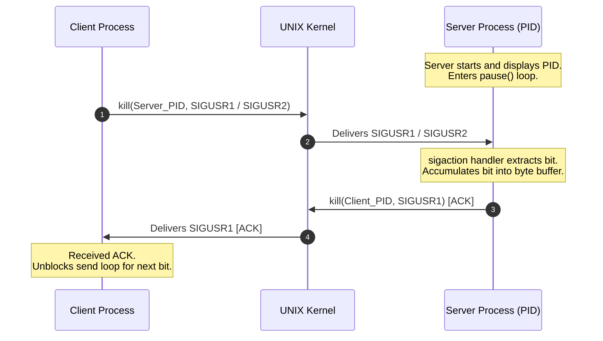

# Minitalk 📡

> A lightweight, reliable Inter-Process Communication (IPC) system built in C that transmits strings between processes bit-by-bit using UNIX signals.

---

## 💡 Overview

### Non-Technical Summary
Imagine wanting to transmit a secret message between two computers using only a single light bulb that can flash in two colors. **Minitalk** works on this exact principle. It is a client-server application where one program (the client) converts a message into binary code (1s and 0s) and sends it bit-by-bit to another program (the server) using standard UNIX system signals (`SIGUSR1` and `SIGUSR2`). The server receives these signals, decodes them back into letters, and displays the complete message in real time.

### Technical Summary
Minitalk is a systems-level C project designed to demonstrate **Inter-Process Communication (IPC)**, **UNIX signal handling**, and **bitwise data manipulation**. Operating without standard networking sockets, pipes, or files, Minitalk relies entirely on OS signals (`SIGUSR1` for bit `1` and `SIGUSR2` for bit `0`). To overcome signal non-queueing in UNIX kernels and prevent data loss, the implementation features a **custom synchronous handshake protocol** via `sigaction` signal handlers and bidirectional feedback.

---

## ✨ Key Features & Engineering Highlights

- **Custom Signal-Based Protocol**: Deconstructs ASCII/UTF-8 characters into 8 individual bits transmitted sequentially via `SIGUSR1` and `SIGUSR2`.
- **Reliable Handshake Mechanism (ACK)**: Implements process synchronization where the client waits for an acknowledgment signal from the server after sending each bit, eliminating race conditions and dropped signals.
- **Low-Level System Calls**: Utilizes POSIX system primitives including `sigaction`, `kill`, `pause`, and `getpid`.
- **Bitwise Efficiency**: Performs zero-allocation bit shifting (`<<`, `>>`) and bitwise masking (`&`, `|=`) for maximum throughput and minimal CPU overhead.
- **Robust Process Validation**: Validates target PIDs prior to signal dispatch, gracefully managing invalid target processes or signal delivery failures.
- **Zero External Dependencies**: Built using pure C and a custom-built utility library ([libft](file:///home/souhail/Desktop/Desktop/PORTFOLIO/minitalk/libft)).

---

## 🛠️ Technical Architecture & Data Flow

### 1. Signal-to-Bit Mapping
| Signal | Constant Name | Binary Value | Meaning |
| :--- | :--- | :---: | :--- |
| `SIGUSR1` | `BIT_1` | `1` | High bit state |
| `SIGUSR2` | `BIT_0` | `0` | Low bit state |

### 2. Sequence Diagram (Client <-> Server Handshake)



### 3. Bitwise Transmission Logic

- **Encoding (Client)**: Each character byte is evaluated bit-by-bit from bit 0 to bit 7 using right shifts and masking:
  ```c
  if (((c >> bit_index) & 1) == 1)
      kill(server_pid, SIGUSR1);
  else
      kill(server_pid, SIGUSR2);
  ```
- **Decoding (Server)**: The server receives incoming signals inside a `sigaction` handler configured with `SA_SIGINFO` to extract the sender's PID. Bits are reconstructed onto a character byte using bitwise OR operations:
  ```c
  if (sig == SIGUSR1)
      current_char |= (1 << bit_count);
  bit_count++;
  if (bit_count == 8)
  {
      ft_putchar_fd(current_char, 1);
      // Reset state for next byte
  }
  ```

---

## 🧠 Key Learnings & Skills Demonstrated

| Concept | Description & Implementation |
| :--- | :--- |
| **UNIX Systems Programming** | Deep understanding of process IDs (PIDs), signal delivery (`kill`), non-queueing signal dynamics, and POSIX signal handlers (`sigaction`). |
| **Inter-Process Communication** | Designing a low-level IPC protocol across isolated execution contexts without high-level networking abstractions. |
| **Concurrency & Synchronization** | Preventing race conditions and dropped signals via a dynamic client-server handshake mechanism. |
| **Bitwise Operations** | Direct manipulation of binary data using bit shifts (`<<`, `>>`) and bitwise operators (`&`, `|=`). |
| **Defensive C Programming** | Validating user inputs, detecting signal delivery errors, checking process existence (`kill(pid, 0)`), and state isolation. |
| **Software Architecture** | Modular codebase design paired with automated GNU Make build infrastructure. |

---

## 📁 Repository Structure

```
minitalk/
├── Makefile       # Master build script (compiles server & client)
├── minitalk.h     # Main header file (signal defines & includes)
├── server.c       # Server implementation (signal receiver & decoder)
├── client.c       # Client implementation (encoder & signal sender)
└── libft/         # Custom C utility library & custom ft_printf
```

---

## 🚀 Getting Started

### Prerequisites
- Operating System: **Linux** or **macOS**
- Compiler: `gcc` or `clang` (`cc`)
- Build Tool: GNU `make`

### Building the Project

Compile both the `server` and `client` binaries using the Makefile:

```bash
make
```

### Usage Example

1. **Start the Server**:
   In one terminal window, run the server:
   ```bash
   ./server
   ```
   *Output:*
   ```text
   Server PID: 42424
   ```

2. **Send a Message from the Client**:
   In a second terminal window, pass the Server PID and your message string to the client:
   ```bash
   ./client 42424 "Hello, Recruiters! 🚀 Minitalk IPC working seamlessly."
   ```

3. **Server Output**:
   The server decodes and prints the message directly to `stdout`:
   ```text
   Hello, Recruiters! 🚀 Minitalk IPC working seamlessly.
   ```

### Clean Up

To remove compiled object files and executables:

```bash
# Remove object files
make clean

# Remove object files and binary executables
make fclean

# Rebuild the entire project from scratch
make re
```

---

## 👨‍💻 Author

Crafted with care as part of a software engineering portfolio to showcase low-level UNIX systems engineering and C programming mastery.
