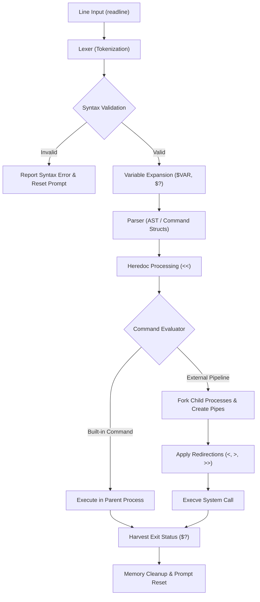

# Minishell — POSIX-Compliant UNIX Command Shell in C

[-blue.svg)](https://en.wikipedia.org/wiki/C_(programming_language))
[](https://pubs.opengroup.org/onlinepubs/9699919799/)
[](https://www.gnu.org/software/make/)
[](https://valgrind.org/)

> **Minishell** is a lightweight, fully functional UNIX command-line shell written from scratch in **C**. It recreates core capabilities of standard UNIX shells like Bash and Zsh—including process creation, pipeline execution (`|`), stream redirections (`<`, `>`, `>>`), Heredoc processing (`<<`), environment variable expansion (`$VAR`, `$?`), custom built-in commands, and interactive signal handling (`SIGINT`, `SIGQUIT`).

---

## 💡 Executive Summary

### For Non-Technical Recruiters & Hiring Managers
Think of **Minishell** as the command-line interface (CLI) engine that powers developer terminal applications. When a software engineer types a command into their Mac or Linux terminal, a shell parses that input, launches software programs, routes output between programs, and manages system memory and signals. 

Building a shell from scratch in **C** requires manual implementation of features that high-level programming languages handle automatically. This project demonstrates foundational software engineering capabilities:
- **Low-level Memory Safety**: Dynamically allocating and releasing memory without memory leaks.
- **Process Management**: Coordinating concurrent execution of multiple programs on the computer.
- **System-level Architecture**: Structuring a multi-stage data processing pipeline (reading, tokenizing, parsing, expanding, executing).
- **Edge-Case Resilience**: Handling unexpected inputs, interrupt signals, and file system errors gracefully.

### For Technical Recruiters, Tech Leads & Engineers
**Minishell** is an end-to-end POSIX-style command interpreter that models the full process lifecycle of UNIX systems programming:
- **Lexical Analysis & Syntax Validation**: Converts raw terminal input into a token stream with quote state awareness (`'` vs `"`) and pre-execution syntax validation.
- **Inter-Process Communication (IPC)**: Manages pipelines using UNIX `pipe()` and `dup2()` file descriptor duplication to connect stdout of process \(N\) to stdin of process \(N+1\).
- **Process Synchronization**: Spawns isolated child processes via `fork()`, executes binary paths resolved through `$PATH` via `execve()`, and harvest exit statuses using `waitpid()`.
- **Signal Handling**: Implements precise signal masks (`sigaction`/`signal`) across three distinct shell states: interactive prompt, pipeline execution, and multi-line Heredoc input.
- **State Management & Builtins**: Maintains dynamic environment state via a key-value structure and implements process-mutating builtins (`cd`, `export`, `unset`, `exit`) directly within the parent process.

---

## 🛠️ Architecture & Pipeline Flow

The shell operates as an event-driven loop that processes user input through a clean, modular execution pipeline:



---

## ✨ Features & Technical Implementation

### 1. Lexing & Parsing Engine
- **Tokenizer**: Scans line inputs to categorize substrings into tokens (`WORD`, `SQUOTE`, `DQUOTE`, `PIPE`, `OP_IN`, `OP_OUT`, `OP_HEREDOC`, `OP_APPEND`, `VAR`).
- **Quote Context Awareness**:
  - **Single Quotes (`'`)**: Preserves all characters literally, suppressing variable expansion and operator evaluation.
  - **Double Quotes (`"`)**: Preserves literal spaces and operators while permitting environment variable expansion (`$VAR`).
- **Token Concatenation**: Automatically merges adjacent quote and word tokens (e.g., `echo "Hello "world` $\rightarrow$ `Hello world`).
- **Syntax Validator**: Rejects malformed commands (e.g., unclosed quotes, un-targeted pipes `| |`, trailing operators) before attempting to fork processes.

### 2. Variable & Environment Expansion
- **Environment Context**: Manages shell variables loaded from system `envp` during initialization.
- **Variable Resolution**: Expands variables prefixed with `$` within words and double-quoted strings.
- **Exit Code Tracking (`$?`)**: Tracks the exact exit status (0–255) of the last executed pipeline or builtin command.

### 3. Process Execution & Pipelines
- **Single & Multi-Process Execution**:
  - **Single External Commands**: Spawns a single child process via `fork()`, resolves executable binaries using `PATH`, and executes via `execve()`.
  - **Pipelines (`cmd1 | cmd2 | cmd3`)**: Allocates an array of `pipe()` file descriptor pairs. Connects output to input across process chains using `dup2()`.
- **Descriptor Lifecycle Hygiene**: Rigorously closes unused read/write pipe ends in both parent and child processes to prevent descriptor leaks, file lock deadlocks, or hung processes.
- **Status Harvesting**: Uses `waitpid()` to wait for all child processes in a pipeline, capturing termination signals (`SIGINT`, `SIGQUIT`) and exit status codes.

### 4. File Redirections & Heredoc System
- **Input Redirection (`<`)**: Replaces `STDIN` with an open file descriptor.
- **Output Redirection (`>`)**: Replaces `STDOUT` with a newly created/truncated file.
- **Append Redirection (`>>`)**: Replaces `STDOUT` with a file opened in append mode (`O_APPEND`).
- **Heredoc (`<<`)**: 
  - Captures multi-line user input up to a user-defined delimiter.
  - Writes input to temporary files in `/tmp` with randomized unique suffixes.
  - Supports variable expansion inside heredoc lines unless the delimiter is quoted.
  - Ensures clean interrupt control: pressing `Ctrl+C` cancels the heredoc cleanly without exiting the shell.

### 5. Native Shell Built-ins
To modify the shell's own environment and execution state, built-in commands run directly inside the main parent process:
| Built-in | Description | Implementation Highlight |
| :--- | :--- | :--- |
| `echo` | Output arguments to STDOUT | Supports `-n` flag suppression of trailing newline. |
| `cd` | Change working directory | Updates `PWD` and `OLDPWD` environment variables dynamically via `chdir()`. |
| `pwd` | Print working directory | Calls `getcwd()` to output absolute current working directory. |
| `export` | Set/Export environment variables | Validates identifier syntax (`[a-zA-Z_][a-zA-Z0-9_]*`) and updates key-value pair linked list. |
| `unset` | Remove environment variables | Safely unlinks and frees target variable entries from environment structure. |
| `env` | Display environment variables | Prints current exported key-value environment list. |
| `exit` | Terminate shell session | Validates numeric exit code arguments, frees all allocations, and exits gracefully. |

### 6. Signal Management Matrix
Signal handlers (`sigaction` / `signal`) adapt dynamically based on the current shell execution phase:
- **Interactive Mode**: `Ctrl+C` (`SIGINT`) prints a new prompt on a fresh line; `Ctrl+\` (`SIGQUIT`) is completely ignored.
- **Child Execution Mode**: Restores default signal behavior so child commands (e.g., `cat`, `grep`, `top`) handle interrupts normally.
- **Heredoc Mode**: `Ctrl+C` cleanly aborts heredoc input collection, cleans up temporary files, and returns control to the prompt with exit status `130`.

---

## 📚 Technical Learnings & Skills Demonstrated

### 🧠 Core Concepts Mastered
1. **POSIX Systems Programming**: Direct interaction with the Linux system call layer (`fork`, `execve`, `waitpid`, `pipe`, `dup2`, `open`, `close`, `unlink`, `chdir`, `getcwd`, `sigaction`).
2. **Dynamic Memory Safety in C**: Complete ownership of dynamic memory allocations (`malloc`, `free`). Designed leak-free memory structures for AST/Command tables, token lists, and environment arrays, validated with **Valgrind**.
3. **File Descriptor & I/O Multiplexing**: Understanding standard streams (`STDIN_FILENO`, `STDOUT_FILENO`, `STDERR_FILENO`) and file descriptor tables across parent-child process boundaries.
4. **State Machine Parsing**: Building robust lexers capable of navigating complex string inputs with mixed quote contexts and escape characters.
5. **Modular Code Architecture**: Organizing a large-scale C codebase (>60 source files) into well-defined domain directories (`core`, `lexer`, `parser`, `execution`, `redirection`, `builtin`, `environment`, `signals`, `error`, `utils`).

---

## 📂 Project Structure

```
minishell/
├── Makefile                # Automated compilation rules with -Wall -Wextra -Werror
├── includes/
│   └── minishell.h         # Global header, data structures, and function prototypes
├── libft/                  # Custom C standard utility library helper functions
└── src/
    ├── core/               # Main entry point, lifecycle loop, line reading
    ├── lexer/              # Lexical analyzer, tokenizer, quote handling
    ├── parser/             # Command table creation, syntax validation
    ├── execution/          # Process execution, PATH lookup, pipeline piping
    ├── redirection/        # Redirection handling, Heredoc temporary file management
    ├── builtin/            # Native shell built-in implementations (cd, export, etc.)
    ├── environment/        # Key-value environment linked list & array utilities
    ├── signals/            # Terminal signal handlers (SIGINT, SIGQUIT)
    ├── error/              # Centralized error reporting & cleanup utilities
    └── utils/              # Memory management, variable expansion helpers
```

---

## 🚀 Quick Start & Usage

### Prerequisites
- **Compiler**: `gcc` or `clang` (C99/C11 standard compliant)
- **Build System**: `make`
- **Libraries**: `readline` development files (`libreadline-dev` on Debian/Ubuntu, `readline` via Homebrew on macOS)

### Build Instructions

```bash
# Clone the repository
git clone https://github.com/aybareic/minishell.git
cd minishell

# Compile the binary
make

# Launch Minishell
./minishell
```

### Usage Examples

```bash
# 1. Pipeline with Redirection and Environment Expansion
minishell$ export GREETING="Hello World"
minishell$ echo $GREETING | tr 'a-z' 'A-Z' > output.txt
minishell$ cat output.txt
HELLO WORLD

# 2. Multi-stage Pipeline with Filters
minishell$ ls -l | grep "src" | wc -l

# 3. Heredoc with Variable Expansion
minishell$ cat << EOF
> Current User: $USER
> Exit status of last command: $?
> EOF
Current User: souhail
Exit status of last command: 0

# 4. Built-in Environment & Directory Operations
minishell$ pwd
/home/user/minishell
minishell$ cd src && pwd
/home/user/minishell/src
minishell$ cd -
```

---

## 🏆 Summary Checklist (Portfolio Highlights)

- [x] **Language & Standard**: Written in strict C following `-Wall -Wextra -Werror` compiler flags.
- [x] **Zero Memory Leaks**: Memory allocated during tokenization, parsing, environment tracking, and pipeline execution is completely freed upon exit.
- [x] **POSIX Compliance**: Fully matches UNIX shell signal behaviors, exit codes, and stream redirection specs.
- [x] **Clean Modular Design**: Low coupling, high cohesion across lexing, parsing, execution, and environment domains.

---

*Developed by [Aymeric Bareich](https://github.com/aybareic) as part of the 42 Network Curriculum.*
