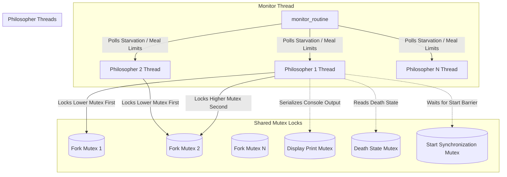
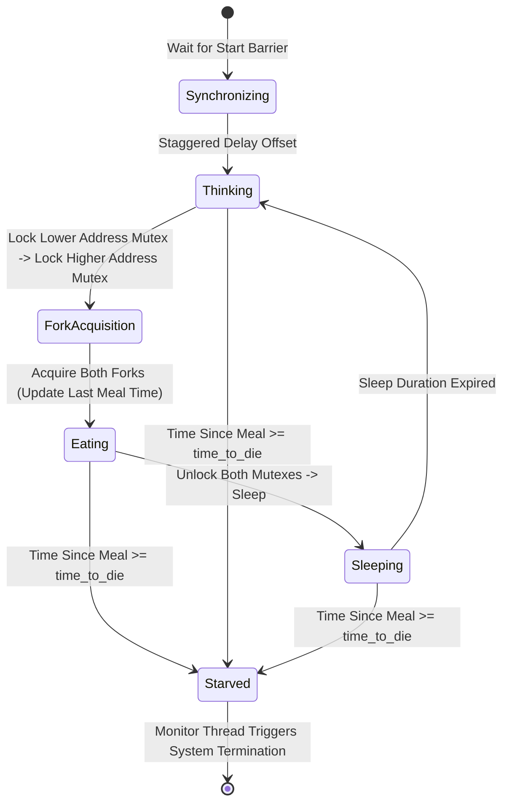

# 🍝 Dining Philosophers — Multi-Threaded Concurrent System in C

[](https://en.wikipedia.org/wiki/C_(programming_language))
[](https://man7.org/linux/man-pages/man7/pthreads.7.html)
[]()

> A high-performance, deadlock-free concurrent simulation of Dijkstra’s classic **Dining Philosophers Problem**, engineered in C using POSIX threads (`pthread`) and mutex locks.

---

## 📌 Executive Summary

### 💡 For Non-Technical Recruiters
Imagine five philosophers sitting around a circular table with five forks. To eat, a philosopher must hold **both** the fork on their left and the fork on their right. Because two adjacent philosophers share a fork, they cannot eat simultaneously. If every philosopher grabs their left fork at the exact same moment, everyone waits forever for a right fork—causing the entire system to freeze (**Deadlock**). Alternatively, if one philosopher is constantly blocked by greedy neighbors, they starve (**Starvation**).

This project is a real-world simulation of how modern operating systems manage shared resources (like CPU cores, shared RAM, or database locks) across multiple processes. It demonstrates robust software engineering principles for building **fast, crash-free, and starvation-free multi-threaded software**.

### ⚙️ For Technical Recruiters & Engineers
This implementation models concurrent agents as POSIX threads competing for shared mutex-protected resources. Key technical highlights:
- **Zero Deadlocks**: Asymmetric lock acquisition strategy based on pointer address sorting during initialization (`left_fork` always holds the lower memory address).
- **Zero Race Conditions**: Fine-grained mutex locking protecting all shared state (`meals_mutex`, `death_mutex`, `print_mutex`, `start_mutex`).
- **Dedicated Observer Thread**: Asynchronous monitoring thread (`monitor_routine`) polling starvation conditions with zero-latency detection without blocking worker threads.
- **Sub-Millisecond Timing Precision**: Custom timing engine (`precise_sleep`) combining `gettimeofday()` microsecond timestamps with hybrid micro-sleeps to eliminate CPU spinning and timing drift.
- **Strict Memory & Resource Cleanup**: Fully safe dynamic allocation handling, clean thread joining, and leak-free mutex destruction.

---

## 🏗️ Architecture & Concurrency Model

### Thread & Synchronization Architecture



### Philosopher State Machine



---

## 🛠️ Key Technical Features & Algorithms

### 1. Pointer-Address Lock Hierarchy Sorting (`assign_forks`)
To break circular wait (a fundamental requirement for deadlocks), forks are assigned such that philosophers **always acquire the lower-address mutex lock first**, regardless of left/right orientation:

```c
// src/init_philos.c
static void assign_forks(t_philo *philo, t_data *data, int i)
{
    philo->left_fork = &data->forks[i];
    philo->right_fork = &data->forks[(i + 1) % data->philo_count];
    if (philo->left_fork > philo->right_fork)
    {
        pthread_mutex_t *temp = philo->left_fork;
        philo->left_fork = philo->right_fork;
        philo->right_fork = temp;
    }
}
```
This guarantees a total lock acquisition order across the system, rendering deadlocks mathematically impossible.

### 2. High-Precision Timing Engine (`precise_sleep`)
Standard `usleep()` can drift on Unix operating systems due to kernel scheduling overhead. To maintain precision:
- `get_time_ms()` converts `gettimeofday()` to millisecond accuracy.
- `precise_sleep()` sleeps in 1ms chunks when remaining time is `> 10ms`, then switches to tight microsecond sleeps as the target timestamp approaches.
- This balances sub-millisecond precision with low CPU utilization.

### 3. Dedicated Asynchronous Observer (`monitor_routine`)
An independent thread continuously monitors philosopher survival without slowing down philosopher routines:
- Calculates elapsed time since last meal: `time_since_meal = current_time - last_meal`.
- Signals immediate simulation shutdown if `time_since_meal >= time_to_die` or if all philosophers complete their required meal quota.

### 4. Edge-Case Handling (1 Philosopher)
When `philo_count == 1`, only one fork exists. The thread acquires the single fork, logs `has taken a fork`, sleeps until `time_to_die + 1`, and allows the monitor thread to report death cleanly without hanging or attempting a second lock.

---

## 🧠 Solved Engineering Challenges

| Challenge | Root Cause | Solution Implemented |
| :--- | :--- | :--- |
| **Deadlocks** | Circular wait when all threads pick up left fork simultaneously. | **Address-Sorted Locks**: Swapping fork pointers at init so lower memory address is locked first. |
| **Data Races** | Concurrent reads/writes to meal counters and timestamps. | **Granular Mutex Locks**: Isolated `meals_mutex` per philosopher, `death_mutex`, and `start_mutex`. |
| **Console Garbling** | Multiple threads calling `printf()` at the exact same microsecond. | **Serialized Logging**: Wrapping log outputs inside a global `print_mutex`. |
| **CPU Overheating** | Busy-wait loops when tracking timers. | **Hybrid Sleep Loop**: Coarse `usleep(1000)` combined with microsecond precision checking. |
| **Startup Contention** | Threads starting out-of-sync causing immediate lock contention. | **Global Start Barrier**: `wait_for_start()` locks threads until all threads finish spawning. |

---

## 🧪 Verification & Test Cases

| Test Case | Command | Expected Outcome |
| :--- | :--- | :--- |
| **Single Philosopher** | `./philo 1 800 200 200` | Takes 1 fork, dies cleanly at 800ms |
| **Basic Survival** | `./philo 5 800 200 200` | Philosophers eat/sleep/think indefinitely without dying |
| **Meal Count Limit** | `./philo 5 800 200 200 7` | All 5 philosophers eat 7 meals & system exits cleanly |
| **Tight Timing Survival**| `./philo 4 315 200 100` | Survival under narrow timing margins |
| **Tight Timing Death** | `./philo 4 310 200 100` | Philosopher dies cleanly within timing tolerance |
| **Stress Test (50 Philos)**| `./philo 50 800 200 200 5` | Handles 50 concurrent threads with zero deadlocks |

---

## 🚀 Quick Start & Compilation

### 📋 Prerequisites
- C Compiler (`gcc` or `clang`)
- POSIX-compliant OS (Linux / macOS)
- `make` utility

### 🔨 Compilation Commands

```bash
# Clone repository
git clone https://github.com/your-username/philosophers.git
cd philosophers

# Compile program
make

# Clean object files
make clean

# Full re-compilation
make re
```

### 🏃 Running the Simulation

```bash
./philo <philo_count> <time_to_die> <time_to_eat> <time_to_sleep> [meals_required]
```

#### Examples:

```bash
# 5 Philosophers running indefinitely
./philo 5 800 200 200

# 5 Philosophers stopping after 5 meals each
./philo 5 800 200 200 5

# 1 Philosopher edge case
./philo 1 800 200 200
```

---

## 📁 Repository Structure

```
philosophers/
├── Makefile                # Build automation (all, clean, fclean, re)
├── README.md               # Portfolio documentation
├── include/
│   └── philosophers.h      # Struct definitions, function prototypes, system headers
└── src/
    ├── main.c              # Entry point & CLI argument validation
    ├── init.c              # Data struct & global mutex initialization
    ├── init_philos.c       # Philosopher struct setup & address-sorted fork assignment
    ├── simulation.c        # Thread creation, startup barrier trigger, thread joins
    ├── philosopher.c       # Philosopher thread routine & single philosopher logic
    ├── forks.c             # Mutex lock acquisition (`acquire_forks`) & release routines
    ├── actions.c           # Eat, sleep, think actions & startup staggering logic
    ├── monitor.c           # Asynchronous supervisor thread for death & meal limit checks
    ├── status.c            # Thread-safe logging (`print_status`) & atomic death flag checks
    ├── sync.c              # Start barrier synchronization helpers
    ├── utils.c             # Millisecond time conversion & `precise_sleep` engine
    └── cleanup.c           # Thread joining, mutex destruction & heap deallocation
```

---

## 👤 Author

- **Portfolio Project**: Dining Philosophers Concurrent System (42 Network Curriculum)
